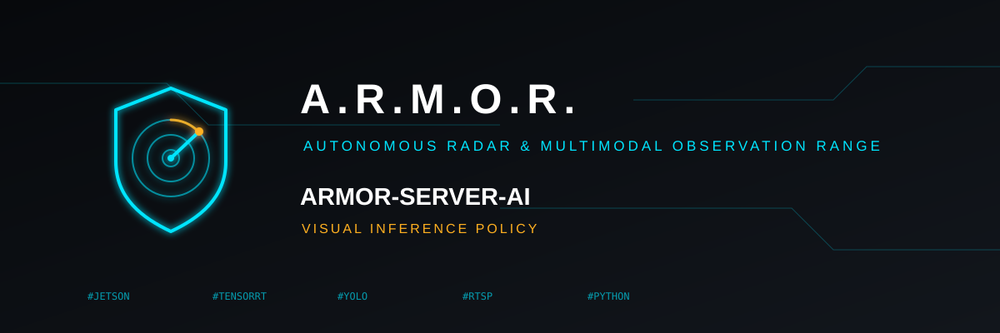

<p align="center">
  
</p>

# 👁️ ARMOR-SERVER-AI

<p align="center">
  🇺🇸 <b>English</b> |
  <a href="README_spa.md">🇪🇸 Español</a> |
  <a href="README_fra.md">🇫🇷 Français</a> |
  <a href="README_ita.md">🇮🇹 Italiano</a> |
  <a href="README_deu.md">🇩🇪 Deutsch</a> |
  <a href="README_zho.md">🇨🇳 简体中文</a> |
  <a href="README_jpn.md">🇯🇵 日本語</a>
</p>

### Visual inference policy: decides and explains, never actuates

<p align="center">
  
  
  
  
</p>

---

**Honesty check - what runs today:** The decision layer is real and tested (35 tests). **No neural detector or TensorRT runs here yet** (that needs the Jetson, and it is not proven): the watching service only compares frames to see that something moved, on the CM5, and has not been tried with a real alarm.

---

## 🎯 Overview

* **Day/night profile with hysteresis:** low-light below 30 lux, back to daylight only above 60 lux and never twice within 30 s, so dusk cannot make it flap.
* **Explainable fusion:** each detection and the radar tracks give a severity (`ignore`, `review`, `high`) with the reasons behind it. A person seen at 80 % or more **and** a radar track is `high`; low light lowers only the review bar; a detection older than 10 s is ignored.
* **Recommendations only:** a decision always carries `authorizes_action = false`. The central server authenticates and authorises every action.
* **Checksum-verified engines:** pre-built TensorRT engines are accepted only if present, non-empty and, with an `engines.json`, matching their SHA-256. Nothing is compiled or downloaded.
* **JSONL worker:** numbered, explained results; a bad line reports its number and never stops the stream.
* **A watching service:** `armor-server-ai` looks at the cameras the server lists every few seconds (grey 64x36 frames through ffmpeg) and, when something moves, asks the policy; with the system armed it raises a `camera_motion` alarm. It speaks to the server with a token of its own and says in its log when its problem changes and when it is over; see [the service](docs/SERVICE.md).

## 📂 Repository Structure

```text
ARMOR-SERVER-AI/
├── src/armor_server_ai/   profile, policy, motion, service, engine_registry, cli
├── tests/
└── docs/INFERENCE_BOUNDARY.md, SERVICE.md
```

## 🛠️ Development Environment

```powershell
$env:PYTHONPATH="src"
python -m unittest discover -s tests
echo '{"label":"person","confidence":0.9,"lux":4,"radar_tracks":1}' | python -m armor_server_ai.cli
```

See the [inference boundary](docs/INFERENCE_BOUNDARY.md).

## 🔗 Related Projects

**A.R.M.O.R.** (Autonomous Radar & Multimodal Observation Range) is a perimeter-security system made of independent repositories. Each one has its own version, its own tests and its own README; this is the family:

* **[ARMOR-COMMON](https://github.com/JuanenRac/ARMOR-COMMON)** - Message contracts, validators, conformance vectors and generated types
* **[ARMOR-RADAR](https://github.com/JuanenRac/ARMOR-RADAR)** - Field-node firmware for ESP32-S3 with three radars and its own web panel
* **[ARMOR-SOLAR](https://github.com/JuanenRac/ARMOR-SOLAR)** - Solar inverter and battery protocols and the messages of a gateway node
* **[ARMOR-ELECTRICAL](https://github.com/JuanenRac/ARMOR-ELECTRICAL)** - Electrical node: meters, the message of the network's readings and the rules for switching
* **[ARMOR-HMI](https://github.com/JuanenRac/ARMOR-HMI)** - Touch panel: the state of the system on a wall screen, arming and acknowledging, and the home of the voice assistant
* **[ARMOR-NETWORK](https://github.com/JuanenRac/ARMOR-NETWORK)** - The local network: its devices, the internet and what changes
* **[ARMOR-SERVER](https://github.com/JuanenRac/ARMOR-SERVER)** - Central coordinator: telemetry, alarms, devices, solar readings and cameras
* **[ARMOR-STUDIO](https://github.com/JuanenRac/ARMOR-STUDIO)** - Web console: cameras, radar, alarms, solar energy and the 2D/3D site designer
* **[ARMOR-ANDROID-CONTROL](https://github.com/JuanenRac/ARMOR-ANDROID-CONTROL)** - Android operator client with a live 2D/3D radar
* **ARMOR-SERVER-AI** (this repository) - Visual inference policy that explains its decisions and never actuates
* **[ARMOR-VOICE-AI](https://github.com/JuanenRac/ARMOR-VOICE-AI)** - Offline voice intents with a confirmation that cannot be forged
* **[ARMOR-HARDWARE](https://github.com/JuanenRac/ARMOR-HARDWARE)** - Enclosures, electronics and the bench acceptance matrix
* **[ARMOR-DEVOPS](https://github.com/JuanenRac/ARMOR-DEVOPS)** - Deployment, the CM5 test bench, backup and TLS
* **[ARMOR-SIMULATOR](https://github.com/JuanenRac/ARMOR-SIMULATOR)** - Offline telemetry simulator with repeatable faults
* **[ARMOR-UPDATER](https://github.com/JuanenRac/ARMOR-UPDATER)** - Detects, installs and updates the ecosystem's own repositories
* **[ARMOR-DOCS](https://github.com/JuanenRac/ARMOR-DOCS)** - Architecture, security baseline and the capability matrix

## 📚 Documentation & Community

Where to read more:

* [Capability matrix: what is proven and what is not](https://github.com/JuanenRac/ARMOR-DOCS/blob/main/docs/CAPABILITY_MATRIX.md)
* [Project catalogue: versions and how the repositories depend on each other](https://github.com/JuanenRac/ARMOR-DOCS/blob/main/docs/PROJECT_CATALOG.md)
* [Changelog of this repository](CHANGELOG.md)
* [License (GPL-3.0-or-later)](LICENSE)
* Questions, ideas and reports: electrohobby3d@gmail.com

## 👤 AUTHOR

**JuanenRac (Electro Hobby 3D)** · electrohobby3d@gmail.com

## 📜 LICENSE

GPL-3.0-or-later - see [LICENSE](LICENSE).
